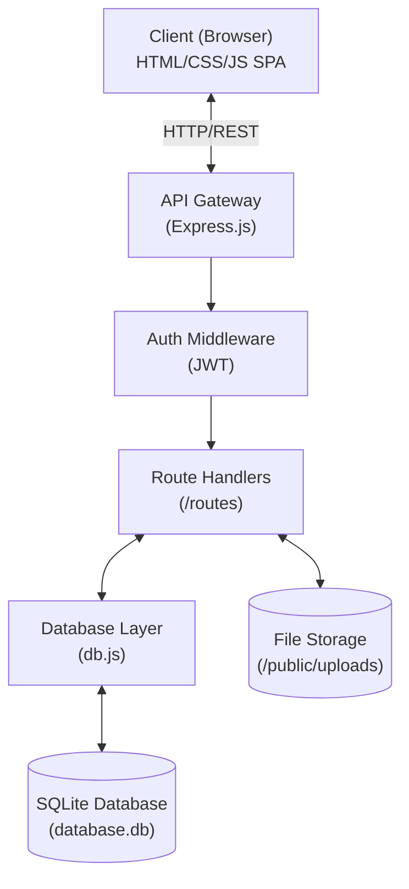
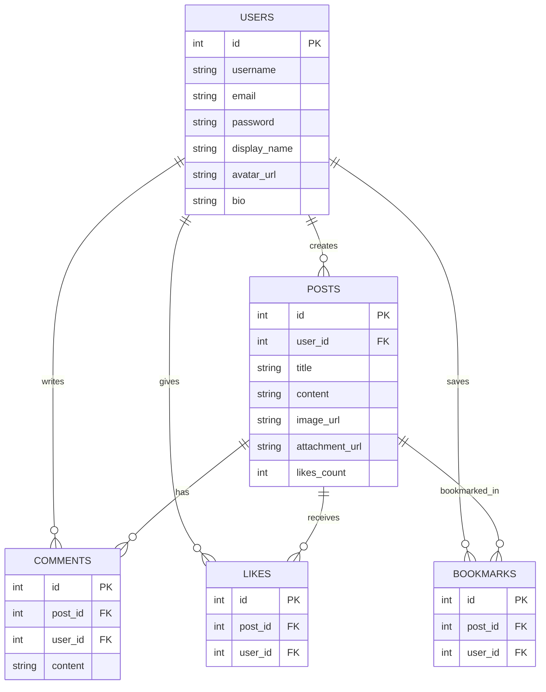

# Nexus — Full-Stack Social Platform

Nexus is a feature-rich, full-stack social networking platform designed to provide a modern, engaging experience. It offers a fully persistent backend with secure authentication, post creation with rich media and document attachments, real-time-like comment interactions, and post bookmarking. The frontend is built as a highly responsive Single Page Application (SPA) with a stunning, glassmorphism-inspired UI and a natively integrated persistent Dark Mode.

## 🚀 Features

- **Real Authentication** — Secure signup/login with bcrypt password hashing & JWT tokens.
- **SQLite Database** — Persistent data storage for users, posts, comments, likes, and bookmarks.
- **RESTful API** — Full CRUD operations with proper validation and robust error handling.
- **Modern UI** — Dynamic glassmorphism design, smooth micro-animations, and a responsive layout.
- **Dark Mode** — A fully integrated and persistent dark mode that responds to user preferences.
- **Saved Posts** — Users can bookmark favorite posts and quickly access them later.
- **Rich Media & Attachments** — Upload profile pictures, attach images, PDFs, and documents to posts.
- **Security** — Built-in rate limiting, CORS protection, and httpOnly cookies.

## 🏗 Architecture Diagram

The system follows a classic decoupled client-server architecture.



## 📊 Database Schema (ERD)



## 🛠️ Tech Stack

| Layer | Technology |
|-------|-----------|
| **Frontend** | HTML5, CSS3, Vanilla JavaScript |
| **Backend** | Node.js, Express.js |
| **Database** | SQLite (via sql.js) |
| **Auth** | bcrypt + JWT |
| **Security** | Rate limiting, CORS, Express Helmet |

## 📦 Quick Start

```bash
# Install dependencies
npm install

# Start the server (runs setup-db.js automatically if no DB exists)
npm run dev

# Open in browser
# http://localhost:3000
```

## 🌐 Deployment

### Google Cloud Run (Recommended)
You can deploy directly to Google Cloud Run from the source.
```bash
gcloud run deploy nexus-platform \
  --source . \
  --region us-central1 \
  --allow-unauthenticated
```

### Render Deployment
1. Push this project to a GitHub repository
2. Go to [render.com](https://render.com) and create a **New Web Service**
3. Connect your GitHub repo
4. Configure:
   - **Build Command:** `npm install`
   - **Start Command:** `npm start`
   - **Environment Variables:** Set `JWT_SECRET` to a secure random string and `NODE_ENV` to `production`

## 📝 API Endpoints

### Auth
| Method | Endpoint | Description |
|--------|----------|-------------|
| POST | `/api/auth/signup` | Create a new account |
| POST | `/api/auth/login` | Log in |
| POST | `/api/auth/logout` | Log out |
| GET | `/api/auth/me` | Get current user |
| PUT | `/api/auth/profile` | Update profile |
| POST | `/api/auth/profile/avatar`| Update avatar image |
| PUT | `/api/auth/change-password` | Change password |

### Posts
| Method | Endpoint | Description |
|--------|----------|-------------|
| GET | `/api/posts` | List posts (with search & pagination) |
| GET | `/api/posts?filter=bookmarks` | List bookmarked posts |
| POST | `/api/posts` | Create a post |
| GET | `/api/posts/:id` | Get a single post |
| PUT | `/api/posts/:id` | Update a post |
| DELETE | `/api/posts/:id` | Delete a post |
| POST | `/api/posts/:id/like` | Toggle like |
| POST | `/api/posts/:id/bookmark`| Toggle bookmark |
| POST | `/api/posts/:id/comments` | Add a comment |
| DELETE | `/api/posts/:id/comments/:cid` | Delete a comment |

## 📁 Project Structure

```
website/
├── server.js              # Express server & middleware
├── db.js                  # SQLite database layer (sql.js)
├── .env                   # Environment variables
├── package.json
├── render.yaml            # Render deployment config
├── middleware/
│   └── auth.js            # JWT authentication middleware
├── routes/
│   ├── auth.js            # Auth routes (signup/login/etc)
│   └── posts.js           # Posts, comments, likes, bookmarks routes
└── public/
    ├── index.html         # SPA frontend
    ├── styles.css         # Design system & styles
    └── app.js             # Frontend application logic
```
